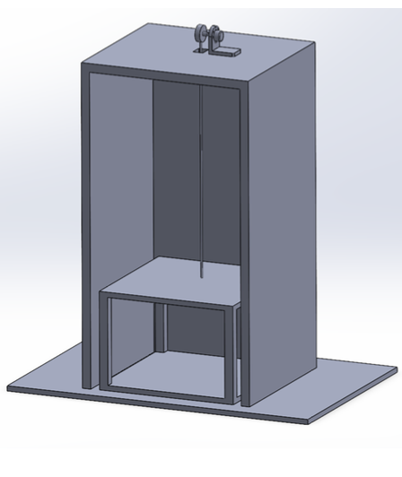

# Arduino Powered Elevator Project

## Overview
This Arduino-powered project aims to build and understand the workings of an elevator. It explores key aspects such as counterweights, sensors, and motor control to simulate an elevator's movement across two floors.

## Objective
The project's primary objective is to gain practical insight into elevator mechanisms, translating theoretical knowledge into a real-world application through Arduino programming and hardware integration.

*Physical Elevator of the Arduino Powered Elevator*

*AutoCAD design of the Arduino Powered Elevator*

*System Design of the Arduino Powered Elevator*

## Hardware Requirements
- Arduino Board (Uno, Mega)
- Stepper Motor
- Stepper Motor Driver
- Push Buttons (2x)
- Microswitches (2x)
- Breadboard and Wiring Accessories

## Software Requirements
- Arduino IDE

## Installation
1. Clone or download the repository.
2. Open the `elevator_final_project.ino` file in Arduino IDE.
3. Connect the Arduino board to your computer.
4. Select the correct board and port in the IDE.
5. Upload the sketch to the Arduino.

## Usage
- Press button 1 to move the elevator to the first floor.
- Press button 2 to move the elevator to the second floor.
- Microswitches are used to detect the elevator's position and stop the motor accordingly.

## License
This project is licensed under the MIT License - see the [LICENSE](https://choosealicense.com/licenses/mit/) file for details.

## References
- [Arduino Stepper Motor Tutorial](https://lastminuteengineers.com/28byj48-stepper-motor-arduino-tutorial/)
- [Tinkercad Simulation Reference](https://www.tinkercad.com/things/ipIUiK3k3ar-stunning-bruticus-lappi/editel)
